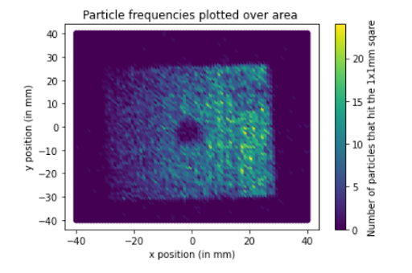

# What does a beam look like?

<a href="https://github.com/saskiapoldmaa/saskiapoldmaa.github.io/blob/main/Files/XCET_scan.csv" download>
    <button style="background-color:#616eff; color:white; border:none; padding:7px 12px; cursor:pointer; font-size:15px; border-radius:5px;">
         👇 Access data!
    </button>
</a>

Is it circular? How wide is it?

What does this graph show?

