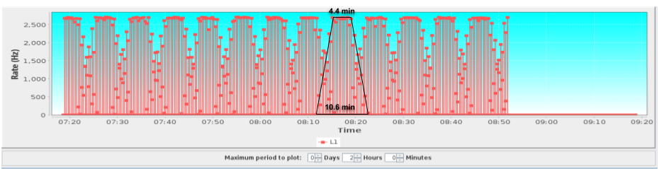
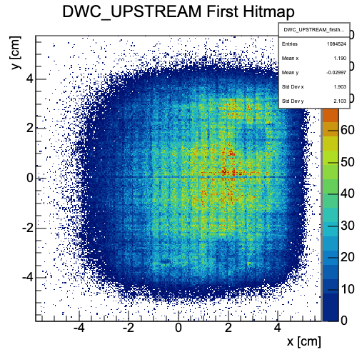
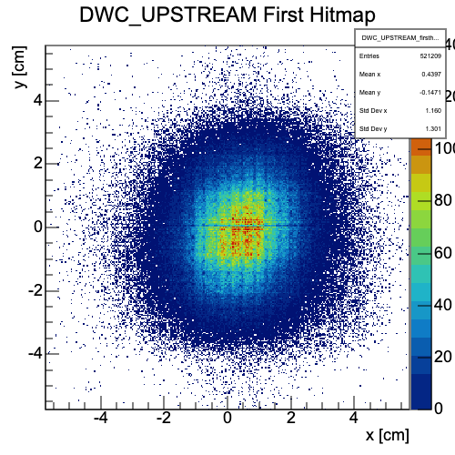

# What does a beam look like?

<a href="https://github.com/saskiapoldmaa/saskiapoldmaa.github.io/blob/main/Files/XCET_scan.csv" download>
    <button style="background-color:#616eff; color:white; border:none; padding:7px 12px; cursor:pointer; font-size:15px; border-radius:5px;">
         👇 Access data!
    </button>
</a>

Is it circular? How wide is it?

This is a screenshot from CESAR – the more archaic one of the two DAQs. It represents the number of particles encountered per second over about a hour and a half. It might not seem obvious, but the frequency is actually at 0 most of the time. However, soemtimes it hovers at the 2,500 Hz mark, and sometimes, it hasn't quite reached that level yet.

Learn to access the beamprofiles of CERN's live beams.

and to recreate this graph...

Coming soon!
