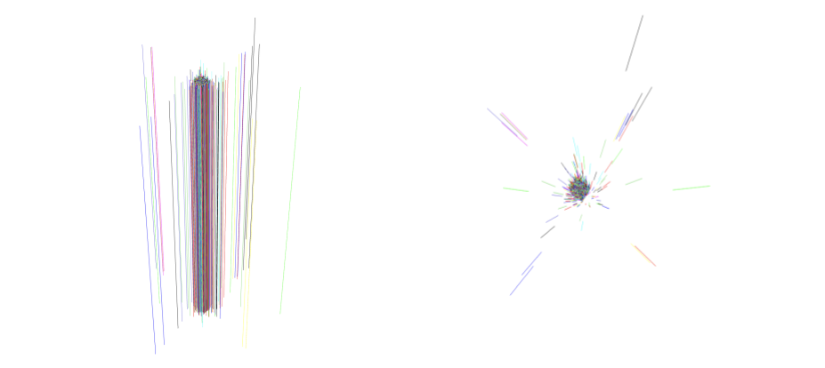

# What does a beam look like?

<a href="https://github.com/saskiapoldmaa/saskiapoldmaa.github.io/blob/main/Files/XCET_scan.csv" download>
    <button style="background-color:#616eff; color:white; border:none; padding:7px 12px; cursor:pointer; font-size:15px; border-radius:5px;">
         👇 Access data!
    </button>
</a>

Is it circular? How wide is it?

This is a screenshot from CESAR – the more archaic one of the two DAQs. It represents the number of particles encountered per second over about a hour and a half. It might not seem obvious, but the frequency is actually at 0 most of the time. However, soemtimes it hovers at the 2,500 Hz mark, and sometimes, it hasn't quite reached that level yet.

The DWC give us an insight into how the beam looks like. Here are some 2D images from DWCs...

for the hadron beam

and for the muon beam.

Curiously, the hadron beam is moch more concentrated. And the muon beam seems to take the shape of a square – well that is actually not because of the beam itself, but simply from the fact that the DWCs are rectangular, and near the edges, they are slightly less efficient.

Here is also a 3D image of the trajectories of 1 000 random hadrons as they move in-between the two DWCs...

<!-- <iframe src="../Files/beamrendering.html" width="800" height="600"></iframe> -->

