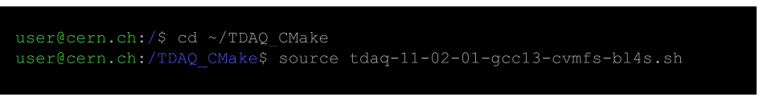
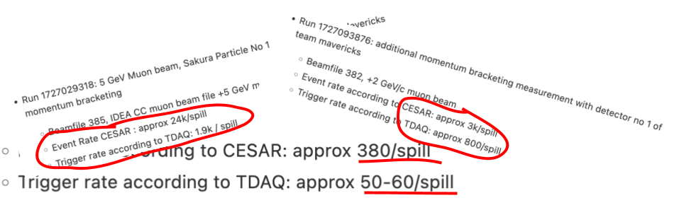
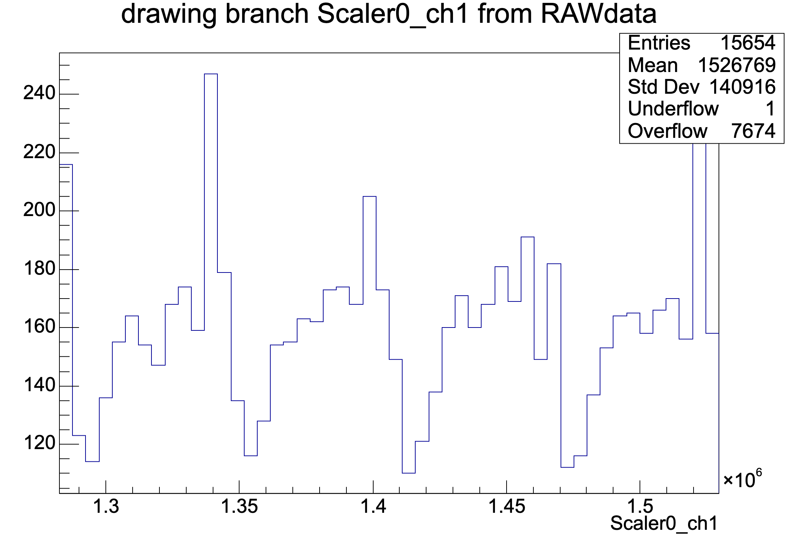

Data Acquisition (DAQ) Systems
==============================
      
Data Acquisition systems, or DAQs, are the heart of experiments. They gather, process, and store data from detectors, allowing the actual research (data analysis) to begin.

Here is a brief ramble about the DAQs we used:
<iframe width="560" height="315" 
  src="https://www.youtube.com/embed/6E5apEYpPSQ?autoplay=1&mute=1" 
  frameborder="0" 
  allow="accelerometer; autoplay; clipboard-write; encrypted-media; gyroscope; picture-in-picture" 
  allowfullscreen>
</iframe>

Actually, I need to add that CESAR is not actually considered a DAQ, but it has a similar operating principle. Don't worry, I'll explain this later.

CESAR is a control software that allowed us to switch on the beam, select beam configurations (momentum, momentum tolerance, collimator settings, etc.), configure detectors such as the XCETs, start pressure scans, and much more.

Although CESAR also acquires data from the detectors, TDAQ () is the software that actually captures the analyzable data (except for pressure scans, these are outside the scope of the TDAQ). 

Why CESAR is not considered a DAQ, is because it can not record the particle-by-particle data that we are interested in. **A major misconception I had before BL4S was that single events happen so fast that there is no way to track down a single particles in the data of all detectors.** This is completely wrong –– particle physics literally relies on being able to group data into events. 

So while CESAR only collects spill-by-spill data (i.e. this many particles per spill detected in X detector), then TDAQ acquires particle-by-particle data, and then writes all of these events into root files.

Also, TDAQ and CESAR are not synchronized and do not "talk" to each other - we did record data during the pressure scans but because CESAR on it's own decides when to change the pressure and what to accept as "valid" measurements for each individual pressure, it is difficult to draw finer-grained data out of the TDAQ recording. 

### What do CESAR and TDAQ actually look like?

Well, this is a typical snapshot of CESAR:

Sadly, TDAQ doesn't have a graphical interface. Instead, it just looks like this...

But if they both collect the same data, only on slightly different scales, then why do we always encounter this...

For some reason, CESAR seems to be seeing much-much more events than TDAQ. Where do the events disappear?

Let us take a look at the scaler data. This is the part of TDAQ data that is closest to whatever CESAR was measuring at the time. Here's what we will see after clicking open the scaler's 1st channel, which was connected to one of the scintillators.

This graph shows the number of events plotted over time (in ns). 

A typical DAQ system includes components like digitizers, triggers, and data storage units. The digitizer converts analog signals from detectors into digital data that can be processed by computers.

The image above illustrates the flow of data within a DAQ system. Detectors produce signals that are digitized, filtered, and stored for analysis. Timing synchronization is critical, and DAQ systems often include precise clocks to ensure accurate event reconstruction.

Modern DAQ systems use software frameworks to manage data flow and enable user-friendly configuration. For example, the CAEN SY5527 system allows seamless integration with custom analysis software, as shown above.

Whether in high-energy physics or medical imaging, DAQs play an essential role in extracting meaningful information from complex experiments.
