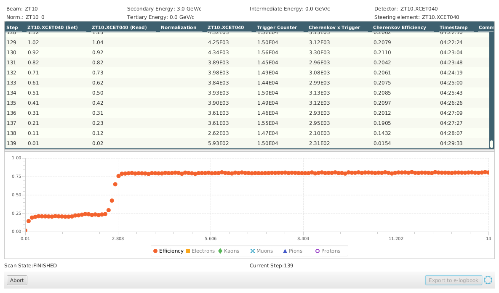

What particles are in the beam?
===============================

Well, there are lots of beams on offer at CERN. You just pick one out from a catalogue, place your order on the computer by selecting the right beamfile, and to place the order, you call to the CCC (CERN Control Centre).

We worked with positive hadron beams – that means the beam is composed of protons, pions, the alike.
Whenever we wanted only muons, we would order for a beamstopper to be put in the beam. The beamstopper is a massive metal block, which stops the particles, and muons are the only decayproducts that can actually penetrate it.

We don't even have to program anything to gain some first insights. Let's look at the Cherenkovs!

A particle emits light in a Cherenkov detector if it exceeds light speed in that medium.

$$v>\\frac{c}{n}$$
where n is the refractive index in that medium and c is the speed of light in that medium. The particle's momentum is then $p=mv$ but since the speeds get very big, we must treat it relativistically, so

$$p=\\frac{m_0 v}{\\sqrt{1-v^2/c^2}}$$ where $m_0$ is the particle's rest mass.

$$P=\\frac{1}{k}\\left( \\frac{\\sqrt{m_0 c^4 -E^2 -2Em_0c^2}}{\\sqrt{E^2+2Em_0c^2}}-1 \\right)$$

