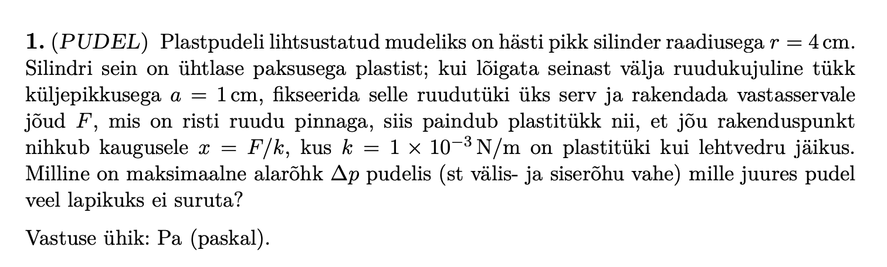
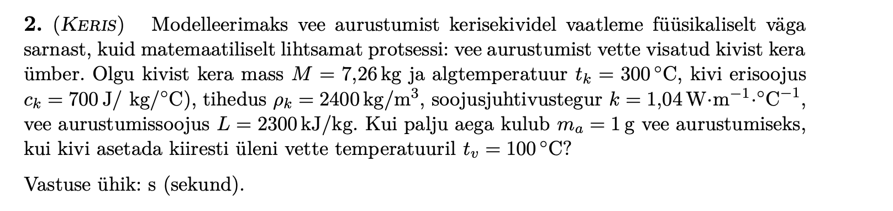
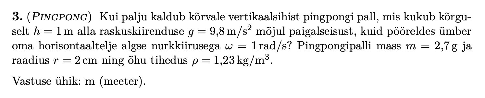
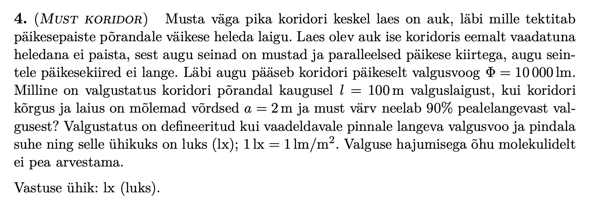
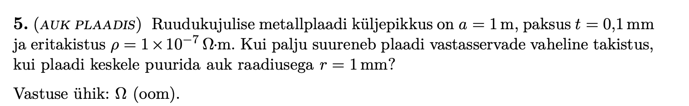

# Seagull 2025

A 300C stone is thrown into cold water. Find how much time it takes to evaporate 1g of water.

This is a standard case of thermal diffusion. I referred to [this](https://physlab.org/wp-content/uploads/2016/04/Doc.pdf) for help.

Our diffusion equation is
$$ \\frac{\\partial T}{\\partial t}=\\frac{\\kappa}{c \\rho} \\frac{1}{r^2} \\frac{\\partial}{\\partial r}\\left(r^2 \\frac{\\partial T}{\\partial r}\\right) $$

We will now take a leap and say that the temperature can be expressed as 
$$ T(r, t)=T_1+\\frac{B(r, t)}{r} $$
where $ T_1 $ is the temperature of the water.

After manipulating the previous formula, we get 
$$ \\frac{\\partial B}{\\partial t}=D \\frac{\\partial^2 B}{\\partial r^2} $$ and our boundary conditions for this equation are 

$ B(r=a, t)=0$, $B(r, 0)=r(T_0-T_1)$, $B(r, \\infty)=0$ and $ B(0, t)=0 $ (because $B\\propto r$).

The ping pong ball develops a horizontal velocity due to the Magnus effect: there is a boundary layer of air, which moves together with the surface of the ping pong ball. Due to the different velocities of the air around the ball, the pressures are different from various sides. 

The horizontal force acting on the ball is
$$ F_x = \\Delta p \\hat{ n } \\cdot \\hat{ x } = \\frac{\\rho}{2} \\int_0^{\\pi}  \\int_0^{2\\pi} |\\mathbf{v}+ \\mathbf{omega} \\times \\mathbf{r} \\sin \\theta|^2 r^2 \|sin \\theta \\cos \\varphi \\,d \\varphi \\,d \\theta$$

which comes out to be $$ F= \\frac{\\rho v \\omega r^3 \\pi^2}{2} $$
but note that v increases as the ball falls, so we must integrate that as well. The ratio of horizontal vs vertical velcoity at impact is

$$\\frac{\\rho \\omega r^3 \\pi^2}{2m} \\sqrt{\\frac{h}{2g}}= 0.004 $$ which is also the deflection in radians.

