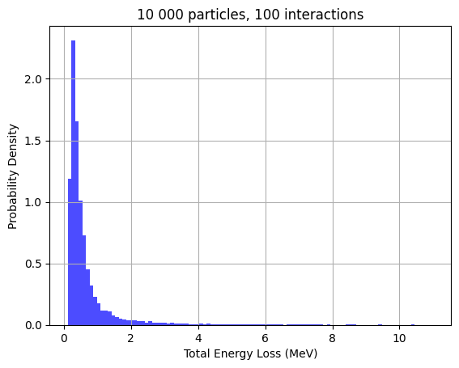
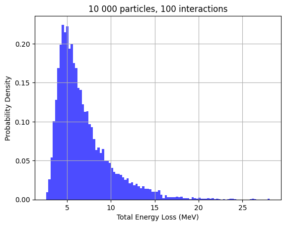
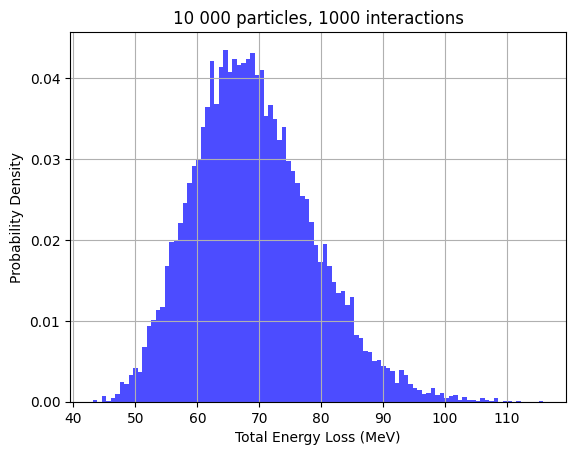

# Deriving spectra – how to generate a Landau distribution?

Whatever energy loss (also known as dE/dx) distribution you look at – QDC data from a scintillator or a calorimeter, signal amplitude of the CosmicWatch, or whatever, you will always come across a very specific distribution. For example...


These are all examples of Landau distributions –– distributions that are fundamentally tied to the energy loss of particles in matter.

Fun fact, these can be derived without using any experimental data. All we need to know is the following formula

$$ \\frac{d \\sigma}{d \\varepsilon} \\propto \\frac{1}{\\varepsilon^2} $$
Here, the $ \\varepsilon $ is the energy loss due to a single interaction, and $ \\sigma $ denotes the cross-section – this is essentially the probability for an interaction with energy loss $ \\varepsilon $ to occur.

Let us first tackle the simulation first because the analytic approach requires Fourier transforms, and thus it is slightly more intricate.

### Monte Carlo Approach

Monte Carlo simulations are used when you know the underlying physics, but have no data, nor the computation power/time to run analytical calculations. So, you generate random inputs, feed them into formulas, and note down the results.

Here, we will use a Monte Carlo simulation alongside *inverse transform sampling*. What is that? 

We will implement a technique for pseudo-random number generation. Essentially, we know that our inputs are supposed to be random, but at the same time, it should also approximately follow a known distribution. For this, we will us the fact that a datapoint has equal probability to occupy any piece of area under the probability distribution. I.e. if 5% of people are known to be shorter than 155cm, and another 5% are known to be between 168cm and 169.2 cm, then our randomly generated datapoint has equal probability of lying in the $ h<155 $cm range, as it has to lie in the $ 168.0$ cm $< h \\leq 169.2 $ cm. 

The inverse transform sampling entails:
- Generating completely random (i.e. uniformly distributed) numbers
- Transforming these random numbers using the inverse of the cumulative distribution function (CDF) of the target distribution

Alright, let's get down to business.

First, we will need the cumulative distribution function (CDF) of our function, let us denote it as $F(\\varepsilon)$.
$$ F(\\varepsilon)= \\int_{\\sigma(\\varepsilon_{min})}^{\\sigma(\\varepsilon)} C \\,d \\sigma=\\int_{\\varepsilon_{min}}^{\\varepsilon} \\frac{C}{\\varepsilon^2} \\,d \\varepsilon$$

$$ F(\\varepsilon)= \\frac{C}{\\varepsilon_{min}} - \\frac{C}{\\varepsilon} $$

where C is a normalization constant. We can find it by noting that the total area under the probability density graph must be 1. Therefore,

$$ C = \\frac{1}{ \\frac{1}{\\varepsilon_{min}} - \\frac{1}{\\varepsilon_{max}} } $$

Now, what we will do is to generate random values of F(x), and then look at which $ \\varepsilon $ values these correspond to. 

$$ \\varepsilon=\\frac{\\epsilon_{min}}{ 1-u \\left( 1 - \\frac{\\varepsilon_{min}}{\\varepsilon_{max}} \\right) } $$ where u is our random value.

In Python, this will be 
```python
import numpy as np
import matplotlib.pyplot as plt

min_energy_transfer = 0.01  # Minimum energy transfer per interaction (MeV)
max_energy_transfer = 10.0  # Maximum energy transfer per interaction (MeV)

def inverse_transform_sampling(size):
    u = np.random.uniform(0, 1, size)
    return min_energy_transfer / (1 - u * (1 - min_energy_transfer / max_energy_transfer))
```
Not only do we have to generate particles, we have to generate multiple interactions for each particles, and then sum the energy losses over the multiple interactions.

```python
num_particles = 10000  # Total number of particles in the simulation
num_interactions = 100  # Number of ionization events per particle

# Simulate energy loss for many particles
total_energy_loss = np.zeros(num_particles)

for i in range(num_particles):
    # Simulate energy transfers for each interaction
    energy_losses = inverse_transform_sampling(num_interactions)
    total_energy_loss[i] = np.sum(energy_losses)

# Plotting the energy loss distribution
plt.hist(total_energy_loss, bins=100, density=True, alpha=0.7, color='blue')
plt.xlabel('Total Energy Loss (MeV)')
plt.ylabel('Probability Density')
plt.title('Derived Landau Distribution from Monte Carlo Simulation')
plt.grid(True)
plt.show()
```




Curiously, although the number of particles has very little effect on the distribution –– the distribution just looks more ideal as you increase the sample size, the number of interactions can vastly change the distribution: the more there are particles, the more the Landau distribution widens, even taking the appearance of a Gaussian. This is because as the number of interactions increases, stochastic effects dominate.

In real life, we won't actually observe ideal Landau distributions (such as the three previous graphs), but instead the convolution of Landau and Gaussian distributions. 

To sum up, the underlying physics behind Landau distributions is simply $\\frac{d \\sigma}{d \\varepsilon} \\propto \\frac{1}{\\varepsilon^2}$ – that the interaction probability scales inversely proportional to $\\varepsilon^2$.

# Analytical Approach

When a charged particle passes through a thin material:

- item It undergoes many small energy losses due to ionization.
- Occasionally, large energy losses occur, leading to a distribution with a heavy right-hand tail.

For thin materials, where the number of collisions is not large enough for the central limit theorem to apply (which would give a Gaussian distribution), the Landau distribution accurately models these fluctuations.

### Mathematical Framework

### Step 1: Setting Up the Problem

Let $ \\Delta $ be the total energy loss after passing through the material. The goal is to find the probability density function $ f(\Delta) $.

Because energy loss is the result of many random, independent ionization events, we can model it using a sum of random variables:

$$
\\Delta = \\sum_{i=1}^{N} \\epsilon_i
$$

where $ \\epsilon_i $ is the energy lost in the $ i $-th collision.

### Step 2: The Characteristic Function (Fourier Transform of the PDF)

The characteristic function $$ \phi(k) $$ of a probability distribution $$ f(\Delta) $$ is the Fourier transform of $$ f(\Delta) $$:

$$
\\phi(k) = \\int_{-\\infty}^{\\infty} e^{ik\\Delta} f(\\Delta) \\, d\\Delta
$$

To find $ f(\\Delta) $, we first derive $ \phi(k) $, and then invert the Fourier transform.

### Step 3: Finding the Characteristic Function

Landau used the fact that the energy transfer in a single collision follows a heavy-tailed distribution. For large energy transfers $$ \epsilon $$, the probability density behaves like:

$$
P(\\epsilon) \\propto \\frac{1}{\\epsilon^2}
$$

This form implies that the variance of energy loss is infinite, which is why the central limit theorem does not apply.

Through a complex statistical treatment, Landau derived that the characteristic function for the total energy loss $ \Delta $ is:

$$
\\phi(k) = \\exp\left( -ik\\lambda \\ln(ik) \\right)
$$

where $ \\lambda $ is a parameter related to the mean energy loss per unit path length.

### Step 4: Inverse Fourier Transform}

To obtain the probability density function $$ f(\Delta) $$, we apply the inverse Fourier transform to $$ \phi(k) $$:

$$
f(\\Delta) = \\frac{1}{2\\pi} \\int_{-\\infty}^{\\infty} e^{-ik\\Delta} \\phi(k) \\, dk
$$

Substituting $ \\phi(k) $:

$$
f(\\Delta) = \\frac{1}{2\\pi} \\int_{-\\infty}^{\\infty} \\exp\\left[ -ik\\Delta - ik\\lambda \\ln(ik) \\right] dk
$$

This integral does not have a closed-form solution in terms of elementary functions. However, it can be expressed in terms of a special function or computed numerically.

### Final Expression for the Landau Distribution

Landau showed that the resulting distribution could be expressed as:

$$
f(\\lambda) = \\frac{1}{\\pi} \\int_0^{\\infty} e^{-t \\ln t - \\lambda t} \\sin(\\pi t) \\, dt
$$

This integral defines the Landau distribution.

- The most probable value of energy loss corresponds to the peak of the distribution.
- The mean of the distribution is undefined due to the heavy tail (infinite variance).

### Properties of the Landau Distribution

- **Asymmetry:** The distribution is skewed to the right, with a long tail toward large energy losses.
- **Most Probable Value (MPV):** The peak represents the most probable energy loss, not the mean.
- **Infinite Variance:** The variance is infinite, which is why the central limit theorem does not yield a Gaussian.


