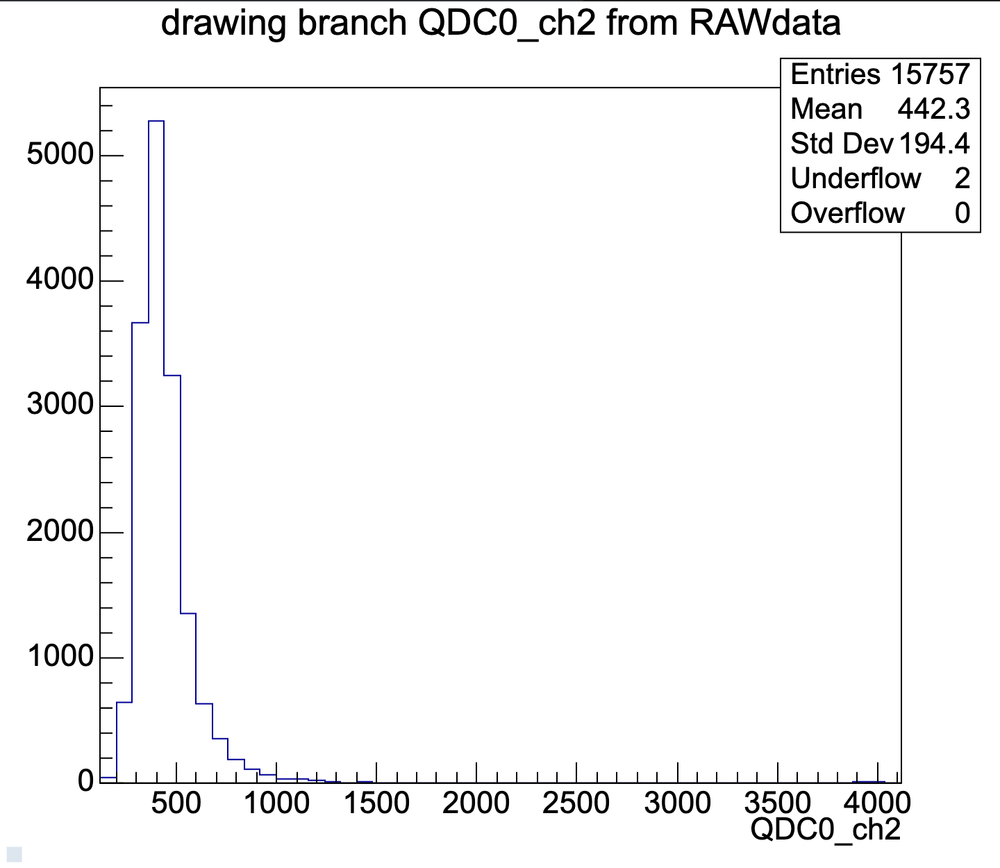
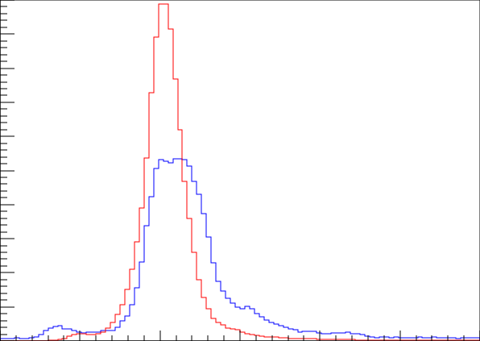
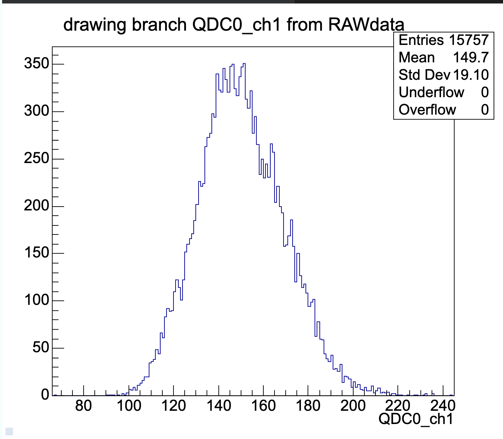

# Deriving spectra – what makes for a Landau distribution?

Whatever spectra you look at – the QDC data from a scintillator, calorimeter, or the signal distribution of our own detector COSMOSS, you will recognize a very specific distribution. For example...

These are all examples of Landau distributions –– distributions that characterize the energy loss of particles in matter.

But these can be derived without using any experimental data. All we need to know, is the following formula

$$ \\frac{d \\sigma}{d \\varepsilon} \\propto \\frac{1}{\\varepsilon^2} $$
