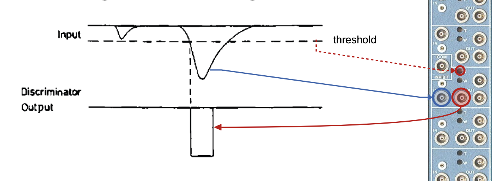

NIM Crates
==========

<iframe src="https://youtu.be/j4yKByB6G5U" style="width: 600px; height: 400px; border: none"></iframe>

If we need to set three signals in coincidence, we should first set two of the signals in coincidence with each other and then set that signal into another coincidence with the 3rd signal. If we just set all of them into one big coincidence, then we could find that the some signal hasn't even arrived before another signal is already gone. This is because of the delays previously discussed, but also because the discriminator signals have an arbitrary (user-defined) length. It is easier for us to elongate the coincidence signal of inputs 1 & 2, in a way that signal 3 would aso fit in the coincidence window, then it is to elongate 2 discriminator signals.

Do signals usually come in bunches or are they more-or-less equally spaced? Well, as it turns out, there is a mathematical reason for them to come in bunches. For events that are both stochastic (random) and memoryless, the probability of an event happening is always highest at the current moment. 

NIM (Nuclear Instrumentation Module) crates serve as the backbone of many laboratory setups in nuclear and particle physics experiments. These crates provide the standardized framework and power supply necessary to house and connect various NIM modules.

The discriminator works just like a comparator. It's output is used as a reference point for when to take measurements. Thanks to the delay component, the comparator's output transition (from 'high' to 'low' or vice versa) occurs precisely when the signal reaches the ADC. The second transition, which signifies the end of the measurement, occurs as the tail end of the signal passes the ADC. 

Here you see the output of a dicriminator and its appearance on a NIM.

The modules plugged into a NIM crate perform tasks like signal amplification, timing, logic processing, and more. Each module adheres to the NIM standard, ensuring compatibility across different systems.

Power distribution is a crucial feature of NIM crates. Each slot provides regulated power to the modules, ensuring stable operation. The above image shows the internal wiring layout of a standard NIM crate.

One notable use of NIM crates is in coincidence measurements. For example, when studying the simultaneous detection of particles in multiple detectors, the signals from each detector pass through NIM modules that generate precise timing and logic outputs.

The NIM standard was developed to facilitate modularity, and it remains widely used despite newer systems like VME and CAMAC being introduced. The simplicity and robustness of NIM crates make them invaluable for small-scale and prototype experiments.
