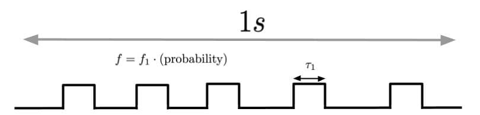
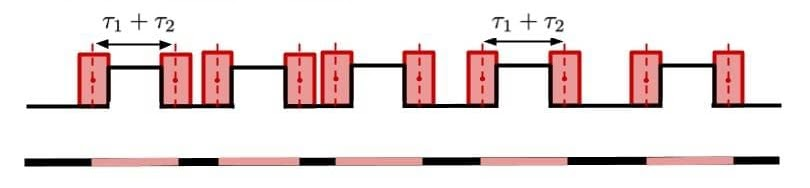

# The Statistics of Noise – Random Coincidence

What we consider an event (a.k.a a particle) is a signal which arrives simultaneously in multiple detectors – the scientific term for this is a coincidence event. These detectors constitute the trigger. We used a combination of two to three scintillators for the trigger. But not all events that they measured were real. 

So, the question arises, **what is the frequency of such phantom events**?

Let us take a trigger with two scintillators. Whenever light is detected by the photomultiplier that is attached to the scintillator, a signal is generated and fed into a NIM. The NIM makes these signal uniform – gives them some pre-specified height and duration. 

There are constantly noise  signals in either of the detectors, let this frequency be, on average, $f_1$ in the first scintillator and $f_2$ in the second scintillator. Random coincidences occur when these noise signal accidentally overlap. Let the frequency of random coincidences be $f$.

If $p$ is the probability that a signal in the first scintillator will stumble upon a signal in the 2nd scintillator, the frequncy of random coincidences will be $pf_1$.

The red bar denotes the positions where the center of the second scintillator's signals cna lie, in order to give a coincidence event.

This red bar covers $(\\tau_1+\\tau_2)f_1$ of the total area (i.e. the total second). In that timeframe, we also have $f_2$ signals from the second scintillator which can be situated in the red spaces. Hence, the probability that one such overlap occurs, is
$$\\boxed{f_1f_2(\\tau_1+\\tau_2)}$$

Now let's go over the numbers. $\\tau$$ are on the order of nanoseconds, something like 20 to 50 ns. Let us take 50 ns for the pessimistic case. $f_1$ and $f_2$ are like 100 Hz. Hence
$$ f = 10^{-5} s.$$

So between each spill, we will get $f\cdot 40s=0.0004$ phantom events, but the number of real events is in tens of thousands.
