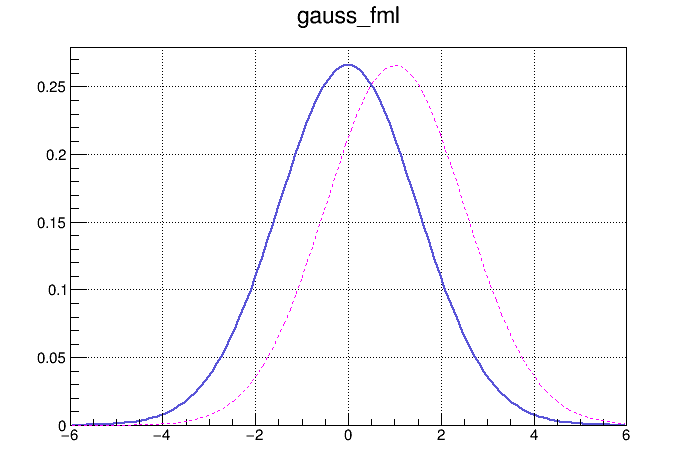
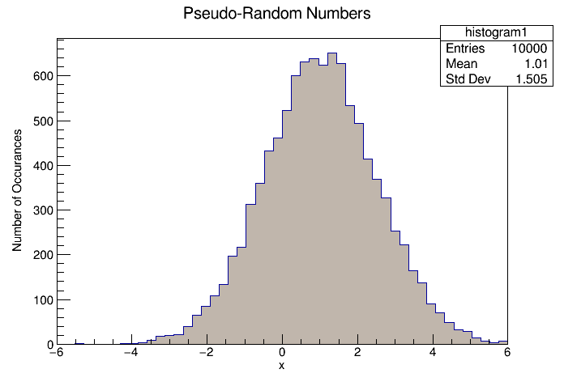

# First Example: Check If Your Local ROOT Can Run A Simple PyROOT Notebook

<a href="https://github.com/saskiapoldmaa/saskiapoldmaa.github.io/blob/main/Files/gaussian_distribution_pyroot.ipynb" download>
    <button style="background-color:#616eff; color:white; border:none; padding:7px 12px; cursor:pointer; font-size:11px; border-radius:5px;">
         👇 Try it out yourself!
    </button>
</a>


Let's try to 
- create a set of random numbers
- that are distributed according to a Gaussian distribution
- and see if we can plot these numbers

But first...

```python
import ROOT
```

### Define the Gaussian Distribution As A Formula With Two Parameters $\sigma$ and $\mu$

Note: there is already a built-in `gaus` formula that you would normally use, but in order to test something simple, we are defining our own formula


```python
gauss_fml = ROOT.TFormula("gauss_fml", "1/([sigma]*sqrt(2*pi)) * exp(-0.5*((x-[mu])/[sigma])*((x-[mu])/[sigma]))" )
```

### Createa 1D Sequences For Different Parameterisations of the Gaussian Distributions

In order to generate a sequence of values according to the formula `gaus_fml`, we have to set the values for the two distribution parameters $\\sigma$ and $\\mu$.


```python
# By default, the parameters are ordered alphabetically, so [mu] is first, then comes [sigma]
gauss_fml.SetParameters( 0.0, 1.5 ) 

# We can retrieve the values for the two parameters using the "Getter" functions:
sigma = gauss_fml.GetParameter( "sigma" ) 
mu = gauss_fml.GetParameter( "mu" ) 
print( f"mu: {mu}, sigma: {sigma}" )

# There is a similar way to set individual parameters, we will be using that in a few steps
```

    mu: 0.0, sigma: 1.5


## Plot The Sequences

In order to "Draw" something (like a plot), we needa a "Canvas":


```python
c1 = ROOT.TCanvas( "c1", "Gaussian Distribution" )
```

Lets generate a sequence of values by evaluating the `gauss_fml` formula on an interval $[x_{min}, x_{max}]$. Since we know that almost all values are within $\pm 3\cdot\sigma$ around the mean value $\mu$, we can use this to find values for $x_{min}$ and $x_{max}$:


```python
xmin = mu - 4.0 * sigma
xmax = mu + 4.0 * sigma

# gauss_values0 is a 1D manifold that can have values between the xmin and xmax boundaries:
gauss_values0 = ROOT.TF1( "gauss_values0", "gauss_fml", xmin, xmax )
```

Let's change one of the distribution parameters and create a second 1D manifold:


```python
gauss_fml.SetParameter( "mu", 1.0 )
gauss_values1 = ROOT.TF1( "gauss_values1", "gauss_fml", xmin, xmax )
```

Please check [the documentation](https://root.cern.ch/doc/master/classTAttLine.html) for an explaination of what the numbers in the `SetLineColor`, `SetLineWidth` and `SetLineAttributes` command refer to


```python
c1.SetGridx()
c1.SetGridy()
gauss_values0.SetLineColor( 9 )
gauss_values0.SetLineStyle( 1 )
gauss_values0.SetLineWidth( 2 )
gauss_values0.Draw()

gauss_values1.SetLineColor( 6 )
gauss_values1.SetLineStyle( 2 )
gauss_values1.SetLineWidth( 1 )
# Using "SAME" in the Draw command re-uses the same canvas for the second plot
gauss_values1.Draw( "SAME" )

```


```python
c1.Draw()
```


    

    


## Create Pseudo Random Numbers & Visualise Them As A Histogramm


```python
c2 = ROOT.TCanvas( "c2", "Histogramm" )
```


```python
n_bins = 50
n_numbers = 10000
histogram1 = ROOT.TH1F( "histogram1", "Pseudo-Random Numbers", n_bins, xmin, xmax )
histogram1.SetFillColor( 11 )

# We are using the "ranged" 1D expression rather than the formula. Otherwise, the "random number generator" would not 
# know for which interval to generate values:
histogram1.FillRandom( "gauss_values1", n_numbers ) 
histogram1.Draw()
histogram1.GetXaxis().SetTitle( "x" )
histogram1.GetXaxis().CenterTitle(True)
histogram1.GetYaxis().SetTitle( "Number of Occurances" )
histogram1.GetYaxis().CenterTitle(True)
```


```python
c2.Draw()
```


    


## Save Some Of The Expressions (and Data) We Have Created Into a ROOT File


```python
output_file = ROOT.TFile( "./example1_gaussian_distribution_python.root", "RECREATE" )

gauss_fml.Write()
histogram1.Write()
output_file.Close()
```
